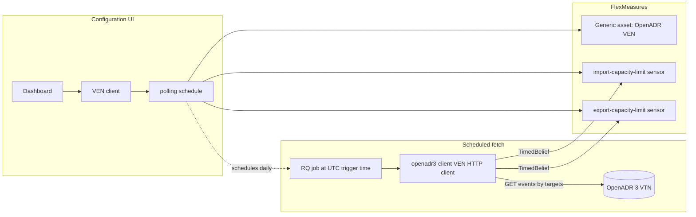

# flexmeasures-openadr3

FlexMeasures plugin that connects to an **OpenADR 3 Virtual Top Node (VTN)** as a **Virtual End Node (VEN)** and ingests demand-response capacity signals into FlexMeasures time-series sensors.

Requires FlexMeasures **≥ v1.0.0** and Python **≥ 3.12**.

## What is OpenADR?

[OpenADR](https://www.openadr.org/) (Open Automated Demand Response) is an industry standard for exchanging demand-response signals between a grid operator or aggregator (**VTN — Virtual Top Node**) and flexible assets or sites (**VEN — Virtual End Node**). Events describe when and how much capacity is available or limited, typically as time-bounded intervals with numeric payloads.

**OpenADR 3.x** modernises the protocol around REST APIs and JSON payloads (compared with the XML-centric OpenADR 2.0b profile). This plugin implements a **VEN client** using the [`openadr3-client`](https://pypi.org/project/openadr3-client/) Open-Source Python library and targets **OpenADR 3.1** VTNs.

### Related: OpenLEADR

[OpenLEADR](https://lfenergy.org/projects/openleadr/) is another [LF Energy](https://lfenergy.org/) project. It provides open-source OpenADR implementations, including a **Rust-based OpenADR 3.1 VTN** ([openleadr-rs](https://github.com/OpenLEADR/openleadr-rs)). OpenLEADR plays the **VTN** role; this FlexMeasures plugin plays the **VEN** role and can consume events published by VTNs such as OpenLEADR.

## Overview

The plugin adds **configuration UI only** — it does **not** extend the FlexMeasures CLI or REST API. All setup happens through the web dashboard.

| Capability | Description |
|------------|-------------|
| **VEN clients** | Register connection details to a VTN: base URL, OAuth client credentials (stored encrypted), and scopes. Each VEN client is represented as a FlexMeasures **generic asset** of type `OpenADR VEN`. |
| **Polling schedules** | Per VEN client, define one or more polling schedules. A polling schedule will run once daily at a configured time in UTC and will fetch demand response signals from the OpenADR VTN configured in the VEN client. |
| **Sensor mapping** | For each polling schedule, the plugin creates or links FlexMeasures **sensors** on the VEN asset and writes incoming event values as **beliefs** (15-minute resolution, kW). |

### Supported signals (current scope)

Only two OpenADR event payload types are supported as of the current release of this plugin:

| Payload type | FlexMeasures sensor | Unit |
|--------------|----------------------|------|
| `IMPORT_CAPACITY_LIMIT` | `import-capacity-limit` | kW |
| `EXPORT_CAPACITY_LIMIT` | `export-capacity-limit` | kW |

Additional OpenADR payload types may be supported in future releases. The ingestion pipeline is limited to these capacity-limit signals for now.

### Dashboard

After installation, open the plugin from the FlexMeasures main menu:

- **Menu label:** OpenADR 3 Configuration
- **URL:** `/flexmeasures-openadr3/dashboard`

From the dashboard you can create and manage VEN clients, polling schedules, and inspect linked sensors.

## How it works



1. An administrator configures a **VEN client** (VTN URL, OAuth) and one or more **polling schedulles** with optional OpenADR targets to filter on and a daily UTC poll time.
2. When signals are enabled, the plugin provisions **import** and/or **export capacity limit** sensors on the VEN asset.
3. An **RQ job** runs at the configured time each day (and reschedules itself after each run). The job calls the VTN, filters events for the supported payload types, validates that active intervals do not overlap, and stores values on the mapped sensors with data source `OpenADR 3 VTN`.
4. These sensors can then be coupled to assets within FlexMeasures. The most obvious mapping for the currently supported signals would be for an OpenADR sensor to map to the `site-consumption-capacity` (import capacity limit) and `site-production-capacity` (export capacity limit) on an asset of the `building` type. But other variations may exist.

## Installation

1. Add the plugin to your FlexMeasures config via `FLEXMEASURES_PLUGINS` (a list). Use either:
   - The filesystem path to this repository, e.g. `/path/to/flexmeasures-plugin-oadr3`, or
   - The installed package name: `flexmeasures_openadr3` (after `pip install` / `uv pip install`).

2. Set FlexMeasures' `FLEXMEASURES_SECRETS_ENCRYPTION_KEYS` (required, FlexMeasures v1.0+): a JSON object mapping key IDs to master key values, e.g. `{"1": "<random 32-byte url-safe token>"}`. This plugin uses FlexMeasures' native platform-secrets feature to encrypt VEN OAuth credentials at rest on the VEN's asset, and this key material must be identical across every process (`server`, any `worker`, and the `cron-scheduler`), exactly like `SECRET_KEY`. Unlike most FlexMeasures settings, this one is **not** read from an environment variable — set it in `flexmeasures.cfg` (in your FlexMeasures instance folder) instead, e.g. `FLEXMEASURES_SECRETS_ENCRYPTION_KEYS = {"1": "<random 32-byte url-safe token>"}`.

3. Ensure an RQ worker is running on the queue used for fetch jobs (currently the `ingestion` queue), this is the default behaviour when using the FlexMeasures CLI run-worker when running FlexMeasures v0.33.0 or higher.

4. Restart FlexMeasures and open **OpenADR 3 Configuration** in the menu.

## Development

We use pre-commit to keep code quality up.

Install necessary tools with:

```bash
pip install pre-commit black flake8 mypy
pre-commit install
```

or:

```bash
make install-for-dev
```

Try it:

```bash
pre-commit run --all-files --show-diff-on-failure
```

To inspect RQ jobs, you can use the rq-dashboard package which can be optionally installed as a dev dependency:

```bash
uv run rq-dashboard --redis-url redis://{USERNAME}:{PASSWORD}@{HOST}:{PORT}/{QUEUE_NAME}
```

In the case of the redis queue configured in the `docker-compose.yml`, this would result in the following command:

```bash
uv run rq-dashboard --redis-url redis://:fm-redis-pass@localhost:6379/0
```
